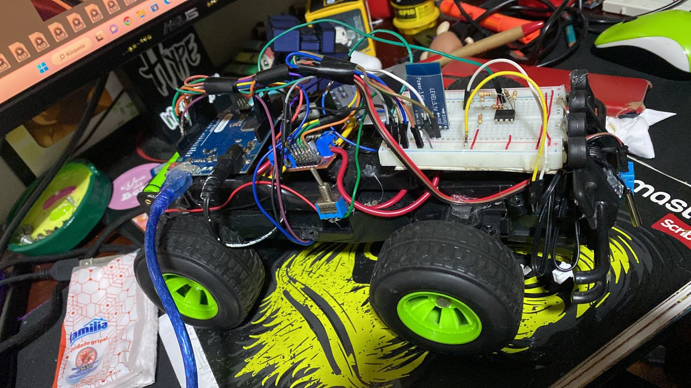
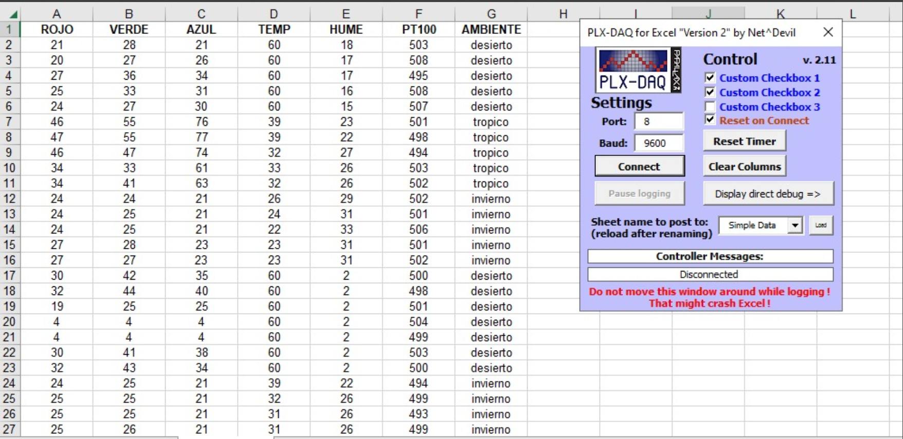

```{r setup, include=FALSE}
knitr::opts_chunk$set(echo = T)
library(tidyverse)
library(caret)
library(knitr)
library(randomForest)
library(rpart)

folder <-  dirname(rstudioapi::getSourceEditorContext()$path )
dataset <-read_csv(paste0(folder,"/Dataset_ambiente.csv"))
datasetcopia <-read_csv(paste0(folder,"/Dataset_ambiente_prueba.csv"))
dataset$AMBIENTE <-as.factor(dataset$AMBIENTE)
datasetcopia$AMBIENTE <- as.factor(datasetcopia$AMBIENTE)

```

## Abstract

The present report is based on the implementation of machine learning to predict three types of environments using the KNN algorithm, decision tree, random forest, and logistic regression. Data was collected from a DHT11 sensor, which measures humidity and temperature, an RGB color sensor TCS3200D TCS230, and a PT100 probe. RStudio was used to train the models with a dataset, and then the prediction was implemented for new data.

For data acquisition and communication, a robot controlled by an Arduino was used, communicating via serial communication with the HC-05 Bluetooth module. This allowed the robot to move easily between different environments and gather data characterizing each one.

Keywords: machine learning, predict, KNN algorithm, decision tree, random forest, logistic regression, DHT11 sensor, humidity, temperature, RGB color sensor TCS3200D TCS230, PT100 probe, RStudio, model training, prediction of new data, data acquisition, serial communication, Arduino, HC-05 Bluetooth module, robot, environments.

## Resumen

El presente informe se centra en la aplicación del aprendizaje automático para predecir tres tipos de ambientes utilizando los algoritmos KNN, árbol de decisiones, bosque aleatorio y regresión logística. Se recopilaron datos de un sensor DHT11 para medir la humedad y la temperatura, un sensor de color RGB TCS3200D TCS230 y una sonda PT100. Se utilizó RStudio para entrenar los modelos utilizando un conjunto de datos y luego se implementó la predicción para nuevos datos.

Para la adquisición de datos y la comunicación, se utilizó un robot controlado por un Arduino, que se comunicaba a través de la comunicación serial con el módulo de Bluetooth HC-05. Esto permitió que el robot se moviera fácilmente entre diferentes ambientes y recopilara los datos que caracterizaban cada uno de ellos.

Palabras clave: aprendizaje de máquina, predecir, algoritmo Knn, árbol de decisiones, bosque aleatorio, regresión logística, sensor DHT11, humedad, temperatura, sensor de color RGB TCS3200D TCS230, sonda PT100, RStudio, entrenamiento de modelos, prediccion de nuevos datos, adquisición de datos, comunicación serial, Arduino, módulo de Bluetooth HC-05, robot, ambientes.

## Introduccion

El aprendizaje de máquina y sus modelos, como KNN, árbol de decisiones, bosque aleatorio y regresión logística, son vitales en la actualidad. Estos modelos permiten resolver problemas complejos y tomar decisiones precisas. KNN clasifica ejemplos según su proximidad, mientras que el árbol de decisiones utiliza reglas jerárquicas. El bosque aleatorio combina múltiples árboles para mayor precisión, y la regresión logística predice probabilidades binarias. Estos modelos analizan grandes volúmenes de datos, revelando patrones ocultos y haciendo predicciones en diversos campos, desde medicina hasta finanzas. Su importancia radica en mejorar la toma de decisiones y generar conocimientos valiosos.

## Materiales

-   Sensor de color RGB TCS3200D TCS230
-   Sensor DHT11
-   Sonda PT100
-   Modulo puente h l298n
-   Carro a control remoto
-   Bluetooth hc-05
-   Arduino UNO
-   Dispositivo Android

## Software

-   RStudio

-   Arduino

-   App inventor

-   Excel

-   PLX-DAQ

## Procedimiento

### adquisision de datos

Se desarrolló un sistema de control remoto para un carro mediante la tecnología Bluetooth, el cual posee la capacidad de moverse a diferentes velocidades y en múltiples direcciones. Para lograr esto, se creó una aplicación utilizando App Inventor, que permite el control preciso del movimiento del carro y la transmisión de datos en tiempo real. La app facilita la interacción con el carro y la recepción de los datos capturados en cada instante.

<div>

<p style="text-align:center;">

{width="195" height="90"}

<p style="text-align:center;">

{withd="1%" width="196"}

</div>

Para la adquisición de datos en tiempo real, se empleó el programa PLX-DAQ, el cual facilita la comunicación entre los datos provenientes del Arduino y Microsoft Excel. Esta integración permitió abrir los datos en RStudio como un archivo CSV, lo que posibilitó su posterior análisis y procesamiento.

<div>

<p style="text-align:center;">

{width="195" height="90"}

</div>

### Entrenamiento e implementacion de los modelos

Se lleva a cabo el análisis exploratorio de datos para cada una de las variables con el objetivo de examinar su comportamiento. Para este propósito, se utiliza la función hist para generar el histograma correspondiente. El análisis exploratorio de datos nos brinda una comprensión inicial de la distribución y características de las variables, lo que nos permite identificar posibles patrones, tendencias o anomalías en los datos. Este proceso es fundamental para obtener información relevante y realizar futuros análisis y modelos basados en los datos disponibles.

```{r include=TRUE,echo=TRUE,eval=F}
head(dataset)
hist(dataset$ROJO,breaks= 10)
hist(dataset$VERDE,breaks= 10)
hist(dataset$AZUL,breaks= 10)
hist(dataset$TEMP,breaks= 10)
hist(dataset$HUME,breaks= 10)
hist(dataset$PT100,breaks= 10)
```

```{r include=TRUE,echo=TRUE,eval=T}
kable(head(dataset))
hist(dataset$TEMP,breaks= 10)

```

Se genera un resumen estadístico del conjunto de datos dataset utilizando la función summary(). Luego, el resultado se formatea en una tabla utilizando la función kable() del paquete knitr para una presentación más legible

```{r include=TRUE, echo=TRUE, eval=T}
kable(summary(dataset))

```

Se convierten las columnas AMBIENTE en factores utilizando la función as.factor(). Esto es útil cuando se trabaja con variables categóricas en modelos de aprendizaje automático.

```{r include=TRUE,echo=TRUE,eval=F}
dataset$AMBIENTE <-as.factor(dataset$AMBIENTE)
datasetcopia$AMBIENTE <- as.factor(datasetcopia$AMBIENTE)
```

Se genera un diagrama de dispersión utilizando las primeras 5 columnas del conjunto de datos dataset. Cada punto en el diagrama de dispersión está marcado con un símbolo (pch) y un color de fondo (bg) determinados por la variable categórica AMBIENTE.

```{r include=TRUE,echo=TRUE,eval=T}
plot(dataset[1:5]

     ,pch=21,bg=c("green","blue3","yellow")[unclass(dataset$AMBIENTE)])
```

### Knn method

Se utiliza Cross-Validation para dividir los datos en un 70% de entrenamiento y un 30% de prueba. Las variables predictoras incluyen los datos del sensor de color (ROJO, VERDE, AZUL) y los sensores de humedad y temperatura. Esto permite evaluar el rendimiento del modelo en datos no vistos y predecir diferentes ambientes.

```{r include=TRUE,echo=T,eval=T}
sample.index <- sample(1:nrow(dataset)
                       ,nrow(dataset)*0.7
                       ,replace = F)

predictors <- c("ROJO","VERDE","AZUL","TEMP","HUME","PT100")
train.data  <-  dataset[sample.index
                                   ,c(predictors,"AMBIENTE")
                                   ,drop=F]
test.data  <-  dataset[-sample.index
                                  ,c(predictors,"AMBIENTE")
                                  ,drop=F]


```

Para entrenar el modelo, se utiliza la función train con los parámetros de la variable a predecir y los sensores. Se emplea el método KNN y se realiza una normalización min-max como preproceso de datos. Esto permite obtener un modelo entrenado y listo para hacer predicciones precisas.

```{r include=TRUE,echo=T,eval=T,warning=FALSE}
ctrl <- trainControl(method = "cv",p=0.7) 
Knnfit <- train(AMBIENTE ~ ROJO+VERDE+AZUL+TEMP+HUME+PT100
                ,data = train.data
                ,method = "knn", trControl = ctrl
                ,preProcess= c("range")
                ,tuneLength=20)
```

Una vez que se tiene el modelo, se evalúa su rendimiento utilizando los valores de prueba. Para esto, se utiliza la función predict, a la cual se le pasa el modelo (Knnfit) y los datos de prueba (test.data). Esta función realiza predicciones basadas en el modelo entrenado, utilizando los datos de prueba para evaluar su desempeño y precisión.

```{r include=TRUE,echo=TRUE,eval=T}
Knnpredict <- predict(Knnfit,newdata = test.data)

```

Para visualizar los resultados, se genera la matriz de confusión. Esta matriz proporciona una representación visual de la precisión de las predicciones del modelo. Permite identificar y analizar la cantidad de clasificaciones correctas e incorrectas realizadas por el modelo en cada clase o categoría. La matriz de confusión es una herramienta útil para evaluar el rendimiento del modelo y determinar posibles áreas de mejora.

```{r include=TRUE,echo=TRUE,eval=TRUE}
Knnpredict <- predict(Knnfit,newdata = test.data)
confusionMatrix(Knnpredict,test.data$AMBIENTE)

```

### ARBOL DE DESICION
Se ajusta un modelo de árbol de decisión utilizando la función rpart. El modelo predice la variable   "AMBIENTE" utilizando las variables predictoras "ROJO", "VERDE", "AZUL", "TEMPERATURA", "HUMEDAD" y "PT100". Se  especifica el método de clasificación y los datos de entrenamiento.
```{r include=TRUE,echo=TRUE,eval=T}
fit  <-  rpart(AMBIENTE ~ ROJO+VERDE+AZUL+TEMP+HUME+PT100 
             ,method = "class"
             ,data=dataset)
```

Se grafica el ARBOL DE DECISIONES:

```{r include=TRUE,echo=TRUE,eval=T,warning=F}
rpart.plot::rpart.plot(fit)

```
Luego se puede ver que el arbol tiene 3 ramas con las cuales el Xerror va disminuyendo
```{r include=TRUE,echo=TRUE,eval=T,warning=F}
kable(fit$cptable)

```

```{r include=TRUE,echo=TRUE,eval=T,warning=F}
treepredict <- predict(fit,newdata = datasetcopia)
kable(treepredict)
```

### RANDOMFOREST

Con el propósito de obtener un modelo sólido, se realiza nuevamente el proceso de validación cruzada durante el entrenamiento. En este caso, se divide el conjunto de datos en un 70% para entrenamiento y un 30% para prueba de manera aleatoria. Esta técnica de división aleatoria del dataset busca proporcionar una representación adecuada de los datos en ambas partes, asegurando así la calidad y robustez del modelo obtenido.

```{r include=TRUE,echo=TRUE,eval=T}
data.samples <- sample(1:nrow(dataset),  
                       nrow(dataset)*0.7, replace = FALSE)
training.data <- dataset[data.samples, ]
test.data <- dataset[-data.samples, ]   


```
Se emplea la función randomForest para entrenar el modelo utilizando nuestras variables predictoras. A continuación, se utiliza el conjunto de datos de prueba (test data) para realizar predicciones. Posteriormente, se genera una tabla que muestra los datos predichos obtenidos por el modelo. Esta tabla proporciona una representación visual de las predicciones realizadas y facilita la comparación con los valores reales.
```{r}
fit.rf <- randomForest(AMBIENTE ~ ROJO  +VERDE + AZUL + TEMP + HUME +
                         PT100, data = training.data)
prediction.rf <- predict(fit.rf, test.data)
kable(table(test.data$AMBIENTE,prediction.rf))
```

## Prueba de los modelos 

Para realizar pruebas de rendimiento en todos los modelos, se recopilan nuevamente datos de los tres ambientes. Estos datos se utilizan para evaluar la precisión de cada modelo en términos de su capacidad para clasificar correctamente los diferentes ambientes. Mediante la comparación de las predicciones realizadas por los modelos con los valores reales de los ambientes, se puede determinar la precisión y eficacia de cada modelo en la tarea de clasificación. Este proceso de prueba y evaluación permite obtener una medida objetiva del desempeño de los modelos y facilita la selección del modelo más adecuado para la tarea en cuestión.

### Knn 

```{r include=TRUE,echo=TRUE,eval=T,warning=F}
Knnpredict <- predict(Knnfit,newdata =datasetcopia)
confusionMatrix(Knnpredict,datasetcopia$AMBIENTE)
```
El modelo muestra una alta precisión y especificidad, con solo un error en los nuevos datos.

### ARBOL DE DESICION
```{r}
treepredict <- predict(fit,newdata = datasetcopia)
kable(treepredict)
```

En este caso, el modelo presenta un alto nivel de precisión al identificar correctamente el ambiente tropical. Sin embargo, al clasificar el ambiente invernal, muestra una buena sensibilidad pero una especificidad menos óptima, lo que resulta en cierta confusión entre el ambiente invernal y el desierto.

### Random Forest

```{r}
prediction.rf <- predict(fit.rf, datasetcopia)
kable(table(datasetcopia$AMBIENTE,prediction.rf))
```
Para este modelo se tiene una mejor respuesta ya que solo se hizo una prediccion mal de los nuevos datos.

## Conclusiones 

- El proyecto ha logrado implementar de manera exitosa un robot controlado por Bluetooth que captura datos de sensores en tiempo real y los envía a un archivo de Excel. Esta integración permite la adquisición eficiente y confiable de datos para su posterior análisis y procesamiento.

- Los resultados obtenidos mediante el uso de aprendizaje de máquina muestran que los tres modelos implementados en el proyecto han tenido una respuesta favorable. Aunque no se alcanzó una precisión perfecta, se ha demostrado que los modelos son capaces de realizar predicciones con un buen nivel de acierto.
